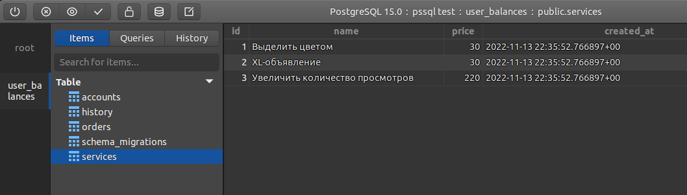
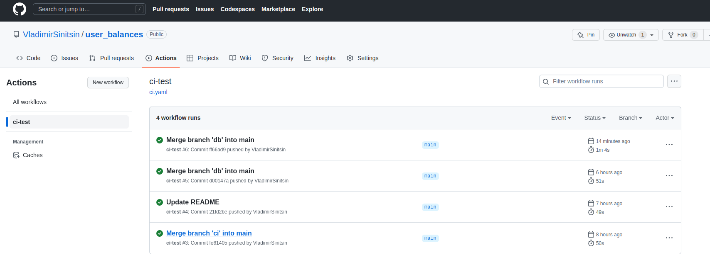
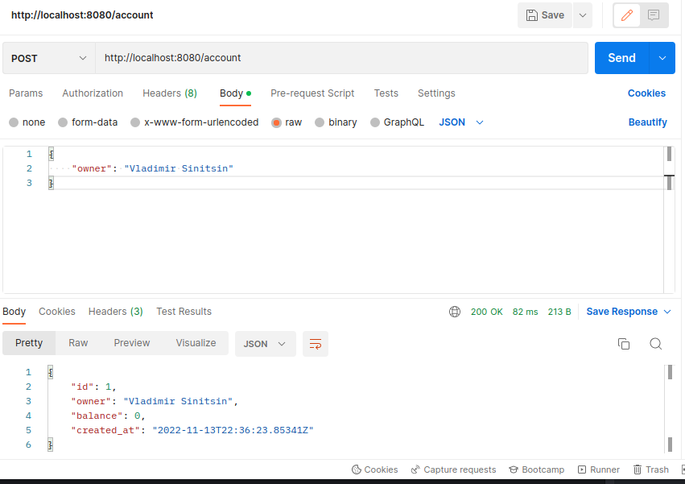
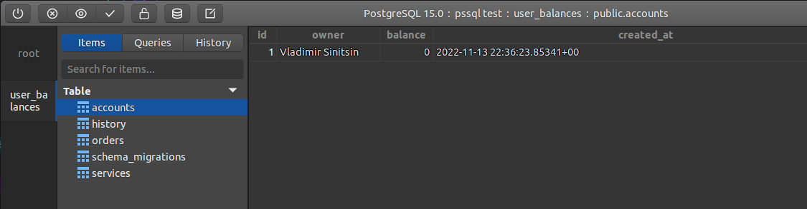
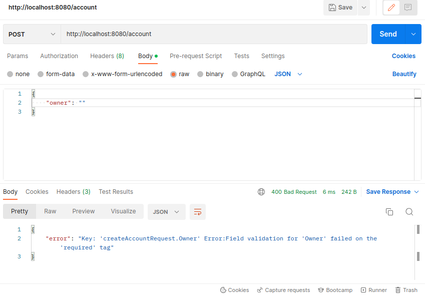
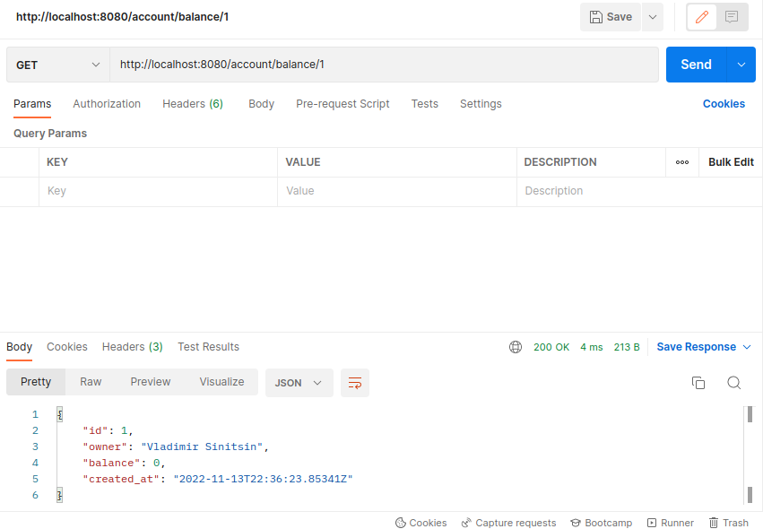
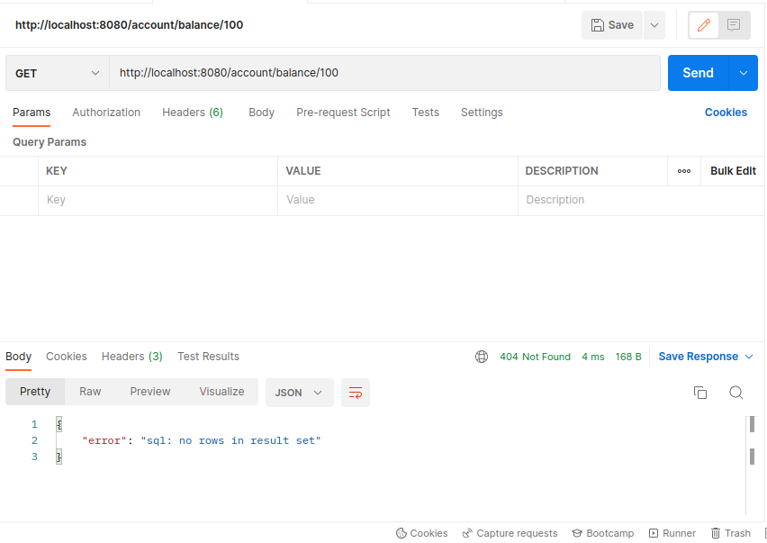
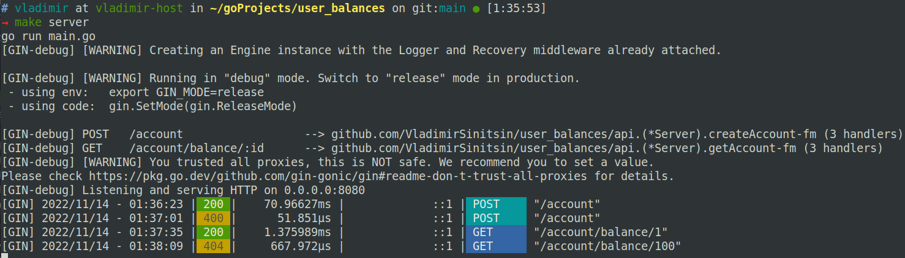

# Микросервис для работы с балансом пользователей

__Техническое задание__ [_здесь_](TR.md)


_К моему большому сожалению, у меня не осталось времени выполнить все требования из ТЗ, в связи с нагрузкой на текущем месте работы.
Но я не считаю свой проект недостойным внимания, так как многие вещи в нём реализованы на достаточном уровне.
Спасибо за уделённое время!_

**Запуск**
```bash
make postgres 
make createdb 
make migrateup 
make server
```

## Реализованы:
- **CRUD операции с БД + покрытие тестами**  
В БД при развёртывании создаются сервисы (аналоги сервисов avito)
<p align="center" width="100%">
    
</p>

- **Транзакции для переводов между клиентами (в т.ч. обход deadlock) + покрытие многопоточными тестами**
```
coverage: 81.2% of statements
```
- **CI тесты**
<p align="center" width="100%">
    
</p>

- **Создана базовая архитектора API сервиса, а также реализации ответов на запросы `/account` и `/account/balance/:id`**   

`POST: /account` код `200`:
<p align="center" width="100%">
    
</p>

<p align="center" width="100%">
    
</p>

`POST: /account` с некорректным `"owner"` код `400`:
<p align="center" width="100%">
    
</p>

`GET: /account/balance/:id` код `200`:
<p align="center" width="100%">
    
</p>

`GET: /account/balance/:id` с некорректным `id` код `404`, так как пользователь не существует:
<p align="center" width="100%">
    
</p>

Благодаря использованию `Gin`, вывод в терминале имеет читаемый вид:  
<p align="center" width="100%">
    
</p>

- Также в репозитории присутствует организация ветвей для разграничения разработки разных областей проекта (`db`, `ci`, `api`) и продакшена (`main`).

## Не реализованы 
### На уровне описания API, вне `sqlc`
1) `[POST] /account/depost` **_(пополнение баланса)_**  
По `id` увеличиваем `Account.balance`, новая запись в `History` с комментарием `"Пополнение баланса аккаунта"`.
2) `[POST] /send` **_(перевод средств из одного аккаунта в другой)_**  
У `id_1` списываем, а у `id_2` пополняем, создаём 2 записи в `History` с комментариями: `"Перевод клиенту {id_2}"` и `"Перевод от клиента {id_1}"`.
3) `[POST] /order` **_(зарезервировать средства на оплату услуги)_**  
Создаём новую запись в `Orders` со статусом `"reserved"`, уменьшаем баланс у данного аккаунта.
4) `[POST] /order/confirm` **_(подтверждаем списание средств за услугу)_**  
Меняем статус (`order.status`) для `order.id` на `"confirmed"`, новая запись в `History` с комментарием `"Оплата услуги {service.name}"`.
5) `[POST] /order/cancel` **_(отменить списание средств за услугу)_**   
Меняем статус (`order.status`) для `order.id` на `"canceled"`, возвращаем `order.amount` на баланс аккаунта.
6) `[GET] /report_services` **_(получить отчёт по услугам)_**   
Проходим по всем услугам из `Services`, и для каждой из них получаем итоговую сумму выручки из `Orders` по `order.id_service`.
7) `[GET] /report_account` **_(получить отчёт по тратам клиента)_**   
Из `History` по `history.id_account` получаем все записи, при помощи `LIMIT`, `OFFSET` и `ORDER BY` делаем пагинацию и сортировку (реализовано на уровне запросов к БД).

### Другое
1) Swagger файл к API (так как сам API не до конца реализован).